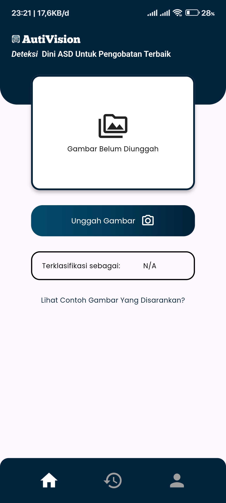
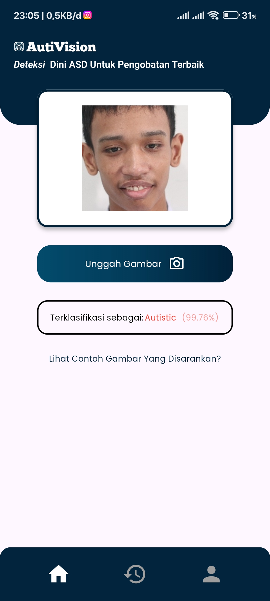
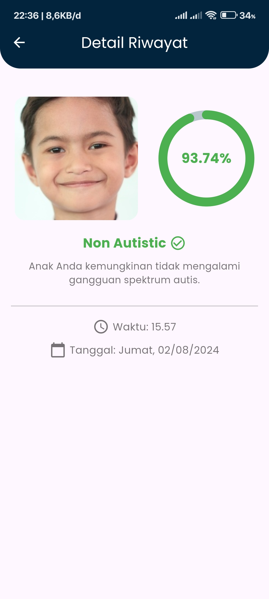
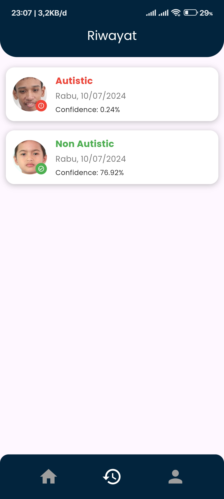

# Autism Detection App


## Overview

Autism Detection App is an open-source Flutter application designed to classify images of children as either autistic or non-autistic using a pre-trained TensorFlow Lite model based on MobileNet-v2. This application also features user authentication and a history page to keep track of previous classifications.

## Features

- **User Authentication**: Secure login and registration functionality.
- **Image Upload**: Upload images directly from the gallery or capture them using the camera.
- **Image Classification**: Classify images into autistic or non-autistic categories.
- **History Page**: View and manage the history of classified images.

## Screenshots

### Main Screen



### Upload Image



### Classification Result



### History



## Getting Started

### Prerequisites

- Flutter SDK: [Install Flutter](https://flutter.dev/docs/get-started/install)
- Firebase Account: [Set up Firebase](https://firebase.google.com/)

### Installation

1. **Clone the repository**:

   ```bash
   https://github.com/Autivision/Application.git
   cd AutiVision
   ```

2. **Install dependencies**:

   ```bash
   flutter pub get
   ```

3. **Set up Firebase**:

   - Create a new project in Firebase.
   - Add an Android app to your Firebase project.
   - Download the `google-services.json` file and place it in the `android/app` directory.
   - Enable Firebase Authentication in the Firebase console.

4. **Run the application**:
   ```bash
   flutter run
   ```

## Usage

1. **Authentication**: Register or log in to access the main features.
2. **Upload Image**: Click on the upload button to select an image from the gallery or capture a new one.
3. **Classification**: View the classification result along with the confidence percentage.
4. **History**: Navigate to the history page to view past classifications.

## Download

[Download the APK](https://drive.google.com/uc?export=download&id=1CjwI5Mv4piFVlQ2fqHUA-6acnGTulXz5)
